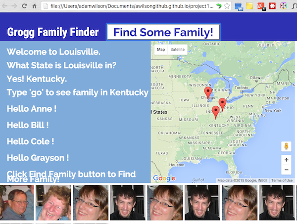

#Project #1: Family Finder Game

### Play The Game at: 

###Object of the Game
Click "Find Some Family!" to find Grogg familiy member names and images. The grandparents, four kids and 7 grandkids are located in various states. Visit their cities, follow the prompts and see them appear as map markers drop on their cities. Visit all 5 families to fill the gameboard with their photos and watch a big group photo appear when "The family's all here!" 

###Requirements Met as of Nov. 12
* hosted online at awilsongithub.github.io/project1
* frequent commits (built mostly in week 2 directory, transferred to .io dir. Nov. 12)
* Readme.md file with explanation

###Not Yet Complete and Unsolved Problems Thus Far
* link in url section of github
* Win the Game feature
* Play game by url
* Form fields for input instead of prompts
* Verification of user inputs with "try again" feature
* Re-initiate map center for each "family visit"

###Project Approach and Learnings
* Skills I wanted to reinforce: jQuery selectors and DOM manipulation. Data retrieval from objects and arrays via API or data internal to my file. Google Maps API. I wanted to expand on the Libary Locator I built in class that did some of the above. 
* Scope, Logic: Jim and James helped me organize my process. What to work on first and then expand upon. 
* BADASAP: Break App Down As Small As Possible.
* James encouraged me to wireframe it out in advance in detail.
* James showed my dev tools breakpoints. These helped me track down a variable update bug.
* Solving logic in a way that works for me.
* Using comments to plan and document 
* color picking and 
* Managing multiple files in Atom.
* v1, v2 to mitigate fear/risk of breaking my code.

